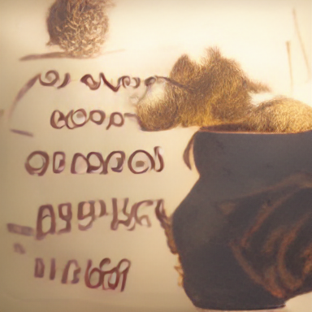
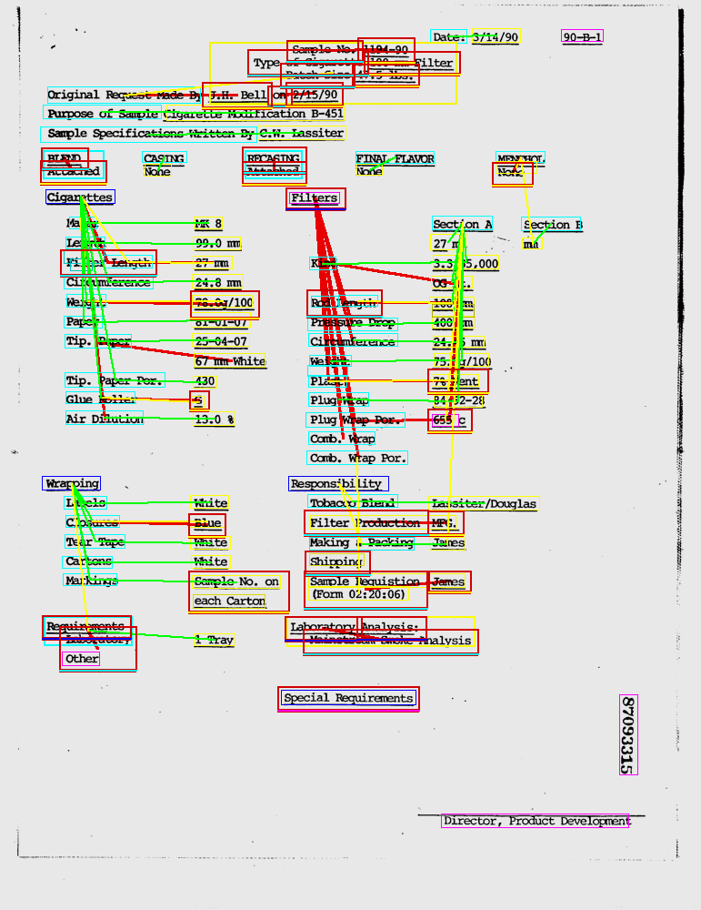
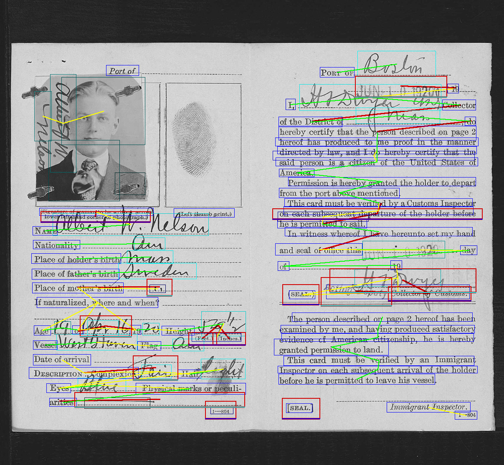

# Visual FUDGE: 
# Form Understanding via Dynamic Graph Editing



This is the code for our ICDAR 2021 paper "Visual FUDGE: Form Understanding via Dynamic Graph Editing" (http://arxiv.org/abs/2105.08194)

Video: https://youtu.be/dUZvm8MP-58

This code is licensed under GNU GPL v3. If you would like it distributed to you under a different license, please contact me (briandavis@byu.net).

  


## Requirements
* Python 3
* PyTorch 1.7+
* scikit-image
* pytorch-geometric https://pytorch-geometric.readthedocs.io/en/latest/notes/installation.html

## Pre-trained Model weights

See `pretrained.tar.gz` in "Releases"


## Reproducability instructions


### Getting the datasets
NAF see https://github.com/herobd/NAF_dataset

FUNSD see https://guillaumejaume.github.io/FUNSD/

The configs expect the datasets to be at `../data/NAF_dataset/` and `../data/FUNSD/`

### Pretraining the detector networks
FUNSD: `python train.py -c configs/cf_FUNSDLines_detect_augR_staggerLighter.json`

NAF: `python train.py -c configs/cf_NAF_detect_augR_staggerLighter.json`

### Training the full networks
FUNSD: `python train.py -c configs/cf_FUNSDLines_pair_graph663rv_new.json`

Word-FUDGE: `python train.py -c configs/cf_FUNSDLinesAndWords_pair_graph663rv_new.json` 

NAF: `python train.py -c configs/cf_NAF_pair_graph663rv_new.json`

The ablation uses the following configs:
* cf_FUNSDLines_pair_binary333rv_new.json
* cf_FUNSDLines_pair_graph9rv_ablate.json
* cf_FUNSDLines_pair_graph77rv_ablate.json
* cf_FUNSDLines_pair_graph222rv_ablate.json
* cf_NAF_pair_binary333rv_new.json

#### Wait, how long does this take to train?
If trained to the full 700,000 iterations, it takes a couple weeks, depending on your GPU. I used a batch size of 1 due to hardware limitations. I also hard-coded the batch size of 1, so you have to as well (GCNs handle batches specially and I didn't want to code that up).

However, from an experiment I ran, I think you can get the same results with only 250,000 iterations by accumulating the gradient to pretend a batch size of 5. This is done by adding `"accum_grad_steps": 5` to `trainer` in the config json. Yes, that means it only updates the weights 50,000 times. It never hurts to train a bit more, it doesn't overfit in my experience.

### Evaluating

If you want to run on GPU, add `-g #`, where `#` is the GPU number.

Remove the `-T` flag to run on the validation set.


Generally (works for detection and full model): `python eval.py -c path/to/checkpoint.pth -T`

Word-FUDGE needs to be told to evaluate using the GT word boxes: `python eval.py -c path/to/checkpoint.pth -T -a useDetect=word_bbs`

For the ablation using line-of-sight proposal: `python eval.py -c path/to/checkpoint.pth -T -a model=change_relationship_proposal=line_of_sight`

For the ablation preventing merges: `python eval.py -c path/to/checkpoint.pth -T -a model=graph_config=0=merge_thresh=1.1,model=graph_config=1=merge_thresh=1.1,model=graph_config=2=merge_thresh=1.1`

To compare to DocStruct `-a gtGroups=1,useDetect=1` is used.


## Usage

### train.py

This is the script that executes training based on a configuration file. The training code is found in `trainer/`. The config file specifies which trainer is used.

The usage is: `python train.py -c CONFIG.json`  (see below for example config file)

A training session can be resumed with: `python train.py -r CHECKPOINT.pth`

If you want to override the config file on a resume, just use the `-c` flag and be sure it has `"override": true`


### eval.py

This script runs a trained model (from a snapshot) through the dataset and prints its scores. It is also used to save images with the predictions on them.

Usage:  `python eval.py -c CHECKPOINT.pth -f OVERRIDE_CONFIG.pth -g (gpu number) -n (number of images to save) -d (directory to save images) -T

The only flags required is `-c` or `-f`.

If `-T` is ommited it will run on the validation set instead of the test set.

If you want it to generate images (like in the paper), use both the `-d` and `-n` flags.

There is an additional `-a` flag which allows overwriting of specific values of the config file using this format `key1=nestedkey=value,key2=value`. It also allows setting these special options (which are part of config):

Evaluating detector:
* `-a pretty=true`: Makes printed picture cleaner (less details)

Evaluatring pairing:
* `-a useDetect=True|word_bbs`:  Whether to use GT detection line boxes or word boxes
* `-a gtGroups=True`: Force use of GT groupings (for DocStruct comparison)
* `-a draw_verbosity=0-3`: Different ways of displaying the results.


### run.py

This will run a model on a single input image and them produce an annotated image.

Usage: `python run.py input/image.png output.png -c path/to/checkpoint.pth`

If running the NAF model, you'll also want to include the argument `--scale-image 0.52` to resize the image appropriately.
If you run a detection model, add the `-d` flag (note: it won't perform non-maximal suppression when doing this).

## File Structure
This code is based on based on victoresque's pytorch template.

  ```
  
  │
  ├── train.py - Training script
  ├── eval.py - Evaluation and display script
  │
  ├── configs/ - where the config files are
  │
  ├── base/ - abstract base classes
  │   ├── base_data_loader.py - abstract base class for data loaders
  │   ├── base_model.py - abstract base class for models
  │   └── base_trainer.py - abstract base class for trainers
  │
  ├── data_loader/ - 
  │   └── data_loaders.py - This provides access to all the dataset objects
  │
  ├── datasets/ - default datasets folder
  │   ├── box_detect.py - base class for detection datasets
  │   ├── forms_box_detect.py - detection for NAF dataset
  │   ├── funsd_box_detect.py - detection for FUNSD dataset
  │   ├── graph_pair.py - base class for pairing datasets
  │   ├── forms_graph_pair.py - pairing for NAF dataset
  │   ├── funsd_graph_pair.py - pairing for NAF dataset
  │   └── test*.py - scripts to test the datasets and display the images for visual inspection
  │
  ├── logger/ - for training process logging
  │   └── logger.py
  │
  ├── model/ - models, losses, and metrics
  │   ├── binary_pair_real.py - Provides classifying network for pairing and final prediction network for detection. Also can have secondary using non-visual features only classifier
  │   ├── coordconv.py - Implements a few variations of CoordConv. I didn't get better results using it.
  │   ├── csrc/ - Contains Facebook's implementation for ROIAlign from https://github.com/facebookresearch/maskrcnn-benchmark
  │   ├── roi_align.py - End point for ROIAlign code
  │   ├── loss.py - Imports all loss functions
  │   ├── net_builder.py - Defines basic layers and interpets config syntax into networks.
  │   ├── optimize.py - pairing descision optimization code
  │   ├── pairing_graph.py - pairing network class
  │   ├── simpleNN.py - defines non-convolutional network
  │   ├── yolo_box_detector.py - detector network class
  │   └── yolo_loss.py - loss used by detector
  │
  ├── saved/ - default checkpoints folder
  │
  ├── trainer/ - trainers
  │   ├── box_detect_trainer.py - detector training code
  │   └── graph_pair_trainer.py - pairing training code
  │
  ├── evaluators/ - used to evaluate the models
  │   ├── draw_graph.py - draws the predictions onto the image
  │   ├── funsdboxdetect_eval.py - for detectors
  │   └── funsdgraphpair_eval.py - for pairing networks
  │
  └── utils/
      ├── util.py
      ├── augmentation.py - coloring and contrans augmentation
      ├── crop_transform.py - handles random croping, especially tracking which text is cropped
      ├── forms_annotations.py - functions for processing NAF dataset
      ├── funsd_annotations.py - functions for processing FUNSD dataset
      ├── group_pairing.py - helper functions dealing with groupings
      ├── img_f.py - I originally used OpenCV, but was running into issues with the Anaconda installation. This wraps SciKit Image with OpenCV function signatures.
      └── yolo_tools.py - Non-maximal supression and pred-to-GT aligning functions
  ```

### Config file format
Config files are in `.json` format. Example:
  ```
{
    "name": "pairing",                      # Checkpoints will be saved in saved/name/checkpoint-...pth
    "cuda": true,                           # Whether to use GPU
    "gpu": 0,                               # GPU number. Only single GPU supported.
    "save_mode": "state_dict",              # Whether to save/load just state_dict, or whole object in checkpoint
    "override": true,                       # Override a checkpoints config
    "super_computer":false,                 # Whether to mute training info printed
    "data_loader": {
        "data_set_name": "FormsGraphPair",  # Class of dataset
        "special_dataset": "simple",        # Use partial dataset. "simple" is the set used for pairing in the paper
        "data_dir": "../data/NAF_dataset",  # Directory of dataset
        "batch_size": 1,
        "shuffle": true,
        "num_workers": 1,
        "crop_to_page":false,
        "color":false,
        "rescale_range": [0.4,0.65],        # Form images are randomly resized in this range
        "crop_params": {
            "crop_size":[652,1608],         # Crop size for training instance
	    "pad":0
        },
        "no_blanks": true,                  # Removed fields that are blank
        "swap_circle":true,                 # Treat text that should be circled/crossed-out as pre-printed text
        "no_graphics":true,                 # Images not considered elements
        "cache_resized_images": true,       # Cache images at maximum size of rescale_range to make reading them faster
        "rotation": false,                  # Bounding boxes are converted to axis-aligned rectangles
        "only_opposite_pairs": true         # Only label-value pairs


    },
    "validation": {                         # Enherits all values from data_loader, specified values are changed
        "shuffle": false,
        "rescale_range": [0.52,0.52],
        "crop_params": null,
        "batch_size": 1
    },

    
    "lr_scheduler_type": "none",
 
    "optimizer_type": "Adam",
    "optimizer": {                          # Any parameters of the optimizer object go here
        "lr": 0.001,
        "weight_decay": 0
    },
    "loss": {                               # Name of functions (in loss.py) for various components
        "box": "YoloLoss",                  # Detection loss
        "edge": "sigmoid_BCE_loss",         # Pairing loss
        "nn": "MSE",                        # Num neighbor loss
        "class": "sigmoid_BCE_loss"         # Class of detections loss
    },
    "loss_weights": {                       # Respective weighting of losses (multiplier)
        "box": 1.0,
        "edge": 0.5,
        "nn": 0.25,
        "class": 0.25
    },
    "loss_params": 
        {
            "box": {"ignore_thresh": 0.5,
                    "bad_conf_weight": 20.0,
                    "multiclass":true}
        },
    "metrics": [],
    "trainer": {
        "class": "GraphPairTrainer",        # Training class name 
        "iterations": 125000,               # Stop iteration
        "save_dir": "saved/",               # save directory
        "val_step": 5000,                   # Run validation set every X iterations
        "save_step": 25000,                 # Save distinct checkpoint every X iterations
        "save_step_minor": 250,             # Save 'latest' checkpoint (overwrites) every X iterations
        "log_step": 250,                    # Print training metrics every X iterations
        "verbosity": 1,
        "monitor": "loss",
        "monitor_mode": "none",
        "warmup_steps": 1000,               # Defines length of ramp up from 0 learning rate
        "conf_thresh_init": 0.5,            
        "conf_thresh_change_iters": 0,      # Allows slowly lowering of detection conf thresh from higher value
        "retry_count":1,

        "unfreeze_detector": 2000,          # Iteration to unfreeze detector network
        "partial_from_gt": 0,               # Iteration to start using detection predictions
        "stop_from_gt": 20000,              # When to maximize predicted detection use
        "max_use_pred": 0.5,                # Maximum predicted detection use
        "use_all_bb_pred_for_rel_loss": true,

        "use_learning_schedule": true,
        "adapt_lr": false
    },
    "arch": "PairingGraph",                 # Class name of model
    "model": {
        "detector_checkpoint": "saved/detector/checkpoint-iteration150000.pth",
        "conf_thresh": 0.5,
        "start_frozen": true,
	"use_rel_shape_feats": "corner",
        "use_detect_layer_feats": 16,       # Assumes this is from final level of detection network
        "use_2nd_detect_layer_feats": 0,    # Specify conv after pool
        "use_2nd_detect_scale_feats": 2,    # Scale (from pools)
        "use_2nd_detect_feats_size": 64,
        "use_fixed_masks": true,
        "no_grad_feats": true,

        "expand_rel_context": 150,          # How much to pad around relationship candidates before passing to conv layers
        "featurizer_start_h": 32,           # Size ROIPooling resizes relationship crops to
        "featurizer_start_w": 32,
        "featurizer_conv": ["sep128","M","sep128","sep128","M","sep256","sep256","M",238], # Network for featurizing relationship, see below for syntax
        "featurizer_fc": null,

        "pred_nn": true,                    # Predict a new num neighbors for detections
        "pred_class": false,                # Predict a new class for detections
        "expand_bb_context": 150,           # How much to pad around detections
        "featurizer_bb_start_h": 32,        # Size ROIPooling resizes detection crops to
        "featurizer_bb_start_w": 32,
        "bb_featurizer_conv": ["sep64","M","sep64","sep64","M","sep128","sep128","M",250], # Network for featurizing detections

        "graph_config": {
            "arch": "BinaryPairReal",
            "in_channels": 256,
            "layers": ["FC256","FC256"],    # Relationship classifier
            "rel_out": 1,                   # one output, probability of true relationship
            "layers_bb": ["FC256"]          # Detection predictor
            "bb_out": 1,                    # one output, num neighbors
        }
    }
}
  ```

Config network layer syntax:

* `[int]`: Regular 3x3 convolution with specified output channels, normalization (if any), and ReLU
* `"ReLU"`
* `"drop[float]"`/`"dropout[float]"`: Dropout, if no float amount is 0.5
* `"M"`": Maxpool (2x2)
* `"R[int]"`: Residual block with specified output channels, two 3x3 convs with correct ReLU+norm ordering (expects non-acticated input)
* `"k[int]-[int]"`: conv, norm, relu. First int specifies kernel size, second specifier output channels.
* `"d[int]-[int]"`: dilated conv, norm, relu. First int specifies dilation, second specifier output channels.
* `"[h/v]d[int]-[int]"`: horizontal or vertical dilated conv, norm, relu (horizontal is 1x3 and vertical is 3x1 kernel). First int specifies dilation, second specifier output channels. 
* `"sep[int]"`: Two conv,norm,relu blocks, the first is depthwise seperated, the second is (1x1). The int is the out channels
* `"cc[str]-k[int],d[int],[hd/vd]-[int]"`: CoordConv, str is type, k int is kernel size (default 3), d is dilation size (default 1), hd makes it horizontal (kernel is height 1), vd makes it vertical, final int is out channels 
* `"FC[int]"`: Fully-connected layer with given output channels


The checkpoints will be saved in `save_dir/name`.

The config file is saved in the same folder. (as a reference only, the config is loaded from the checkpoint)

**Note**: checkpoints contain:
  ```python
  {
    'arch': arch,
    'iteration': iteration,
    'logger': self.train_logger,
    'state_dict': self.model.state_dict(),
    'swa_state_dict': self.swa_model.state_dict(),
    'optimizer': self.optimizer.state_dict(),
    'config': self.config
  }
  ```

